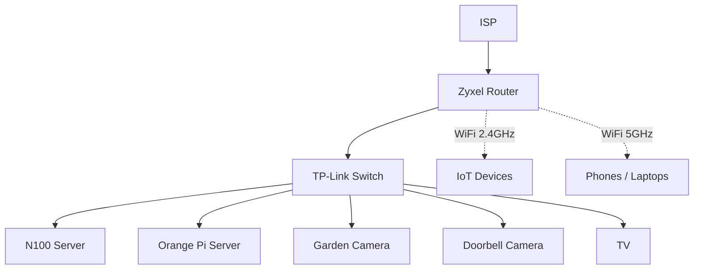
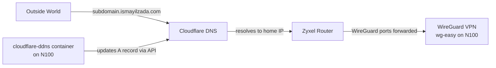

## Hardware Issues

My first ever proper home server was an Orange Pi. It took me a while to set it up and a lot of trial and error, but I eventually managed to set up a server that can store all of our family photos in Immich as well as record security cameras.

When I set up a server, it is normally on my work desk connected to my monitors, etc. After all the setup (Linux at least), I move it downstairs behind the TV, next to where my router and the network switch live. Then the rest of the party can continue over SSH.

When I started importing my photo library to this server, I noticed the whole server slowed down quite badly and even became completely unresponsive. To the point where I needed to restart the server to bring it back to life. For some reason, I thought this 8-core, 16GB RAM machine was just weak and I needed to limit resource usage of Immich to "fix" this issue. And it kinda did for a while. I just limited Immich Docker services to use 1 CPU and 2GB RAM only. Obviously that means slow image processing, but hey.

But then I go on holiday. I had set up a VPN for remote access and it was working on the first day of the holiday. I was able to browse my photos that live on a server in a random English town from the beaches of Malaga. But now, nothing works.

I go back from holiday, I restart the server and everything starts working again. And this is a time that I am trying to prove to my wife that self-hosting is better than iCloud or Google Photos or anything else that ever existed. It is a very bad look that this happens during holiday and I am basically locked out of all of my precious files.

I dig further into logs this time instead of just restarting and going on with my day. I found some traces in the logs showing the system trying to write to the SSD, but the SSD was in some sort of fail-safe mode where it only allowed read operations. As you guessed, I am not the only person who had these kinds of stability issues. And the solution is just to use a 20W power supply. Apparently your average USB adapter (Orange Pi just works with USB-C power) would provide 15W or 25W or even 45W, but not 20W. 20W requires a 5V x 4A configuration that is very "special". Thanks random person on the internet.

When I set up the server on my work desk, I use its provided adapter and everything works great. But for downstairs, I just used a random USB adapter I found in a drawer. Obviously all my issues were fixed once I used a proper PSU, and since then no holidays were ruined.

## Software Issues - or it is always the DNS

That last sentence is true for the Orange Pi only. But since then, I built a separate Intel N100 server too, with its own 300W internal PSU. Can't use a random USB adapter with this one. And it works great for almost 6 months with 100% uptime in my book. Then we go on holiday. I show off my new server to the folks during the holiday on the first day. Second day, nothing works!

This one is more scary because I actually never had any instabilities on this server ever. A PSU did die once before, but that was just a bad unit. Did the new PSU just die too? Who knows.

This time I don't want to wait until I am back. I asked our cat sitter to restart the server over a WhatsApp call. Because why not. I bet that wasn't the strangest thing people asked her to do while cat sitting.

Nothing still works after restart. Time to think. Here is the network diagram of my home servers.

And here is how the subdomain, DDNS and VPN tie together:

My ISP does provide a static IP address, but they are expensive. So, the solution is the [cloudflare-ddns](https://github.com/timothymiller/cloudflare-ddns) repo. This is essentially a script that periodically checks ISP-assigned dynamic IP address of my house and updates the A record of the subdomain by using the Cloudflare API. So simple and genius! Obviously, something like this does not guarantee 24/7 uptime, but it is good enough for me. 100% uptime in my book.

I then host a WireGuard VPN on the N100 server by using [wg-easy](https://github.com/wg-easy/wg-easy). Another brilliant little Docker container that does its job well. Who said WireGuard is too much config and you should just use Tailscale? Don't be afraid, this repo makes the whole setup so simple!

In this long chain of things, many things can go wrong. Even the switch could have just fried while I was on holiday, who knows. But just because there are many things you can't access, it shouldn't stop you from checking things that you can access. And during the holiday, the only thing I could access was the Cloudflare console. So, I tried.

I was literally hopelessly browsing Cloudflare pages hoping that I would notice a "warning" message that maybe there is a Cloudflare incident now and it is not just my problem. Dream of every engineer.

Then I noticed the IP address of my subdomain: 104.18.0.0. Wait, this looks different!

A quick online search shows that this IP belongs to Cloudflare. So, did the script just set the IP of the subdomain to a random Cloudflare IP? How?

I then check the recent GitHub issues of cloudflare-ddns (again hoping that it is not just me), and guess what, [someone else had this issue before too](https://github.com/timothymiller/cloudflare-ddns/issues/243).

So, it seems like a bunch of us were running an old version of this container, so it no longer updates DNS properly!

Now the root cause is clear, we work on the mitigation. I have to find the last known IP address of my home and update it manually in Cloudflare. But this requires one thing: if the ISP rotated the IPs, the last known IP will no longer be useful, so the story would end here.

I dig into the Cloudflare Audit Logs section under the Manage Account tab. There it was, the last time the IP was updated from an actual IP to a rogue Cloudflare IP.

I set the correct A record and guess what, the IP is still assigned to my address, everything works suddenly!

But I have to be quick and shut down the cloudflare-ddns container to stop it overriding the DNS. I stop it, I update to the latest version, then start it again. I could see from the container logs that everything works perfectly and it fetches/updates the subdomain IP correctly!

